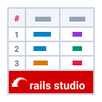
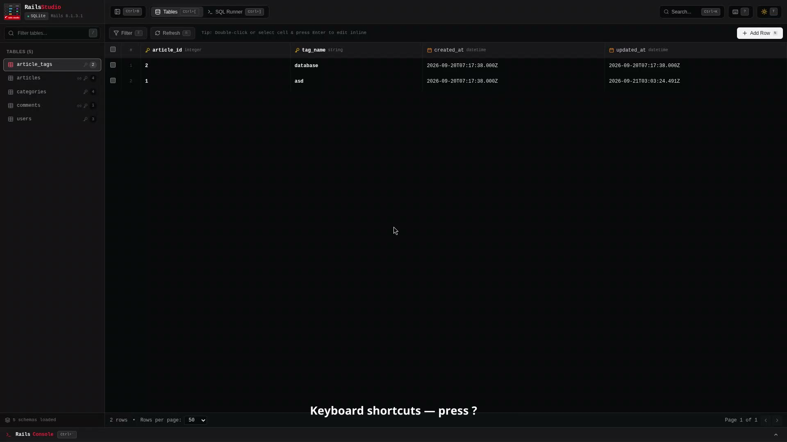

<p align="center">
  <picture>
    <source media="(prefers-color-scheme: dark)" srcset="assets/logo-dark.svg">
    <source media="(prefers-color-scheme: light)" srcset="assets/logo-light.svg">
    
  </picture>
</p>

<p align="center">
  <strong>A modern, fast, and beautiful Web Database Studio for Rails development.</strong><br>
  Inspired by <a href="https://github.com/prisma/studio">Prisma Studio</a> and <a href="https://orm.drizzle.team/drizzle-studio/overview">Drizzle Studio</a>.
</p>

<p align="center">
  <a href="https://rubygems.org/gems/rails_studio"></a>
  <a href="https://github.com/yuler/rails_studio/blob/main/MIT-LICENSE"></a>
  <a href="https://rubyonrails.org/"></a>
  <a href="#-inspiration"></a>
</p>

<p align="center">
  <video src="https://github.com/user-attachments/assets/e578c10e-dfb8-45f1-ae32-a596946f3d12" poster="assets/intro-poster.jpg" width="800" autoplay loop muted playsinline controls>
    <a href="https://github.com/user-attachments/assets/e578c10e-dfb8-45f1-ae32-a596946f3d12"></a>
  </video>
</p>

---

Rails Studio is packaged as a **mountable Rails Engine** with zero dependencies required by the host application (pre-compiled SPA bundled with the gem — **no Node.js or NPM needed in your Rails app!**).

## 💡 Inspiration

Rails Studio was heavily inspired by the remarkable developer experience of two pioneering tools in the modern TypeScript & full-stack ecosystem:

- **[Prisma Studio](https://github.com/prisma/studio)** — The visual, spreadsheet-like database browser for the Prisma ecosystem.
- **[Drizzle Studio](https://orm.drizzle.team/drizzle-studio/overview)** — The lightning-fast, modern database studio for Drizzle ORM.

We wanted to bring that exact same fluid, intuitive, spreadsheet-like database exploration and editing experience to the **Ruby on Rails** and **Active Record** ecosystem — with zero configuration, packaged cleanly as a mountable Rails engine.

---

## ✨ Features

- **🚀 One-Line Integration**: Mount directly inside your Rails `routes.rb` under development with zero configuration.
- **📦 Zero-Dependency Delivery**: Pre-compiled SPA bundled with the gem—no Node.js, Webpack, or asset pipeline setup required.
- **📊 Spreadsheet-like UX**: Browse, filter, sort, and inline-edit records in an interactive table with column badges and sticky headers.
- **🔗 Association Navigation**: Click foreign key badges to inspect and traverse referenced records in a side drawer.
- **💾 Git-like Staging**: Review edited cells locally before committing multiple updates atomically in a single database transaction.
- **⚡ SQL Query Runner**: Execute arbitrary SQL queries with query templates, execution timers, and CSV export.
- **💻 Embedded Rails Console**: Run Ruby and Active Record code in an integrated browser terminal with auto-completion and SQL traces.
- **⌨️ Keyboard-First & Command Palette**: Navigate tables and trigger actions rapidly via `Cmd+K` and built-in keyboard shortcuts.
- **🎨 Dark & Light Modes**: Seamless theme switching with automatic system detection and persistent user preferences.
- **🗄️ Database Agnostic**: Works out of the box with PostgreSQL, MySQL, SQLite, Trilogy, and any adapter supported by Active Record.
- **🧩 Modern Rails Ready**: Fully compatible with Rails 7.1+, 8.0+, composite primary keys, and multi-database architectures.

---

## 🔍 How It Works

Rails Studio operates as a lightweight, self-contained Rails Engine:

1. **Mountable Engine**: Plugs directly into your Rails application pipeline via `config/routes.rb` without affecting your application logic.
2. **Schema & Association Reflection**: Dynamically introspects your Active Record models, column types, and relationships using your existing database connections.
3. **Pre-bundled SPA**: Delivers a modern React frontend directly from the gem's static assets, requiring no JavaScript toolchain in your host app.
4. **Safe Transactions & In-Process Console**: Communicates with internal engine API endpoints to stage edits, commit atomic transactions, and evaluate console commands safely within your Rails runtime.

---

## 🚀 Quickstart

Add to your `Gemfile` and mount the engine in `config/routes.rb`:

```ruby
# Gemfile
group :development do
  gem "rails_studio"
end

# config/routes.rb
Rails.application.routes.draw do
  mount RailsStudio::Engine => "/rails_studio" if Rails.env.development?
end
```

Start your server (`bin/rails server`) and visit [http://localhost:3000/rails_studio](http://localhost:3000/rails_studio).

---

## ⚙️ Configuration (Optional)

You can customize Rails Studio by adding an initializer: `config/initializers/rails_studio.rb`:

```ruby
RailsStudio.configure do |config|
  # Allow access in production (Default: false, strongly recommended to keep false)
  config.allow_in_production = false

  # Read-only mode: prevents updates, creates, and deletes (Default: false)
  config.read_only = false

  # Default pagination records per page (Default: 50)
  config.default_per_page = 50

  # Maximum records allowed per page (Default: 200)
  config.max_per_page = 200

  # Tables excluded from sidebar and inspection
  config.excluded_tables += %w[my_secret_table]
end
```

---

## 🛠️ Development

We use [`mise`](https://mise.jdx.dev/) to manage development tasks:

```bash
mise run setup  # Install dependencies, build assets & prepare test DB
mise run dev    # Start Rails server with frontend build watch
mise run build  # Compile frontend assets into public/assets/
mise run test   # Run automated test suite
```

> **Manual setup**: `bundle install`, `pnpm --dir frontend install && pnpm --dir frontend build`, `cd test/dummy && bin/rails db:migrate db:seed`, then `bin/rails server`.

---

## 📦 Releasing

Maintainers: bump `lib/rails_studio/version.rb`, update `CHANGELOG.md`, run `mise run build`, then `bundle exec rake release`. See [RELEASING.md](RELEASING.md).

---

## 📄 License

The gem is available as open source under the terms of the [MIT License](https://opensource.org/licenses/MIT).
